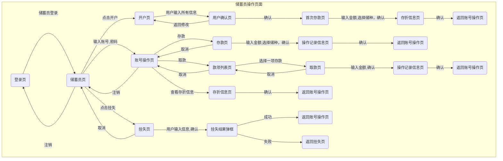
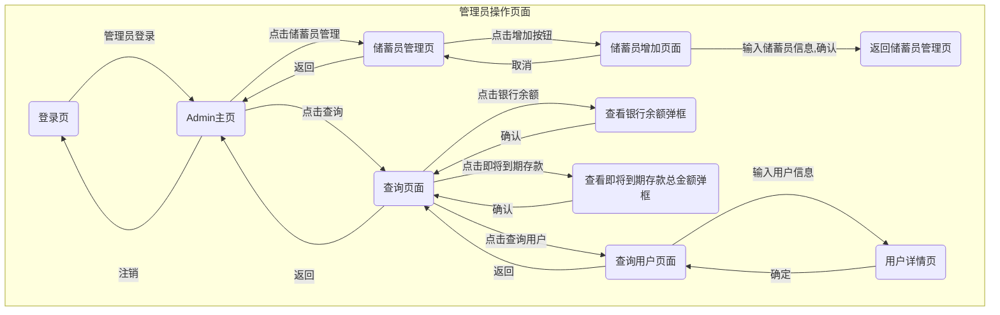

### 银行流程图

```mermaid
graph TB
    A(登录页)
    B(储蓄员页)
    D(开户页)
    E(账号操作页)
    F(挂失页)
    G(用户确认页)
    H(首次存款页)
    I(存折信息页)
    J(返回账号操作页)
    K(存款页)
    L(款项列表页)
    M(存折信息页)
    N(操作记录信息页)
    O(返回账号操作页)
    P(取款页)
    Q(操作记录信息页)
    R(返回账号操作页)
    S(返回账号操作页)
    T(挂失结果弹框)
    U(返回账号操作页)
    W(返回挂失页)
    
    subgraph 储蓄员操作页面
    A-->|储蓄员登录|B
    B-->|注销|A
    B-->|点击开户|D
    B-->|"输入账号,密码"|E
    B-->|点击挂失|F
    D-->|用户输入所有信息|G
    G-->|返回修改|D
    G-->|确认|H
    H-->|"输入金额,选择储种，确认"|I
    I-->|确认|J
    E-->|存款|K
    E-->|取款|L
    E-->|注销|B
    E-->|查看存折信息|M
    K-->|"输入金额,选择储种，确认"|N
    N-->|确认|O
    L-->|选择一项存款|P
    P-->|"输入金额,确认"|Q
    P-->|取消|L
    K-->|取消|E
    L-->|取消|E
    Q-->|确认|R
    M-->|确认|S
    F-->|"用户输入信息,确认"|T
    F-->|取消|B
    T-->|成功|U
    T-->|失败|W
    
	end
```

```mermaid
graph TB

A(登录页)
B(Admin主页)
C(储蓄员管理页)
D(查询页面)
F(储蓄员增加页面)
G(返回储蓄员管理页)
H(查看银行余额弹框)
I(查看即将到期存款总金额弹框)
J(查询用户页面)
K(用户详情页)

subgraph 管理员操作页面
A-->|管理员登录|B
B-->|注销|A
B-->|点击储蓄员管理|C
C-->|返回|B
B-->|点击查询|D
D-->|返回|B
C-->|点击增加按钮|F
F-->|取消|C
F-->|输入储蓄员信息,确认|G
D-->|点击银行余额|H
H-->|确认|D
D-->|点击即将到期存款|I
I-->|确认|D
D-->|点击查询用户|J
J-->|返回|D
J-->|输入用户信息|K
K-->|确定|J
end


```